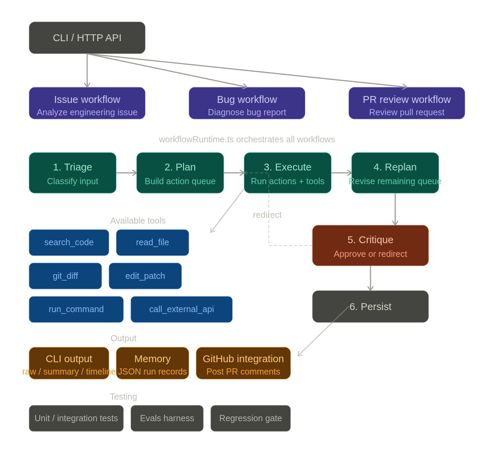

# AI Agent Workflows

An autonomous engineering CLI that applies AI agents to investigate, document, and accelerate engineering workflows in any project connected to Jira and GitHub.

## Documentation map

- [Product vision](./docs/product.md): what the product is, who it is for, and what the roadmap prioritizes
- [Architecture](./docs/architecture.md): how the current runtime is structured and how it works

## What it does

This project is an agentic engineering runtime with a CLI interface. It can read Jira issues, inspect local repositories, use controlled tools, generate documentation, create GitHub pull requests, and review its own reasoning.

### Available commands

| Command | Description |
|---------|-------------|
| `ai jira issue <KEY>` | Analyse a Jira issue and produce a structured breakdown with a technical plan, acceptance criteria, test scenarios, risks, and assumptions. |
| `ai jira analyze <KEY>` | Deep technical analysis of a Jira issue: implementation plan, suggested branch name, PR title, acceptance criteria, and test scenarios. |
| `ai github pr review <NUMBER>` | Review a GitHub pull request by number using live repository context. |
| `ai github pr create <KEY>` | Draft a GitHub pull request from a Jira issue. If `GITHUB_TOKEN` and `GITHUB_REPO` are configured, the PR is opened automatically. |
| `ai repo investigate "<query>"` | Investigate a free-text query against the local repository using code search, file reads, and git history. |
| `ai issue "<text>"` | Analyse a product or engineering issue (flat alias). |
| `ai bug "<text>"` | Diagnose a bug report (flat alias). |
| `ai pr "<text>"` | Review a pull request description (flat alias). |

Each workflow runs as a multi-agent execution loop:

1. A planner proposes the next actions.
2. A specialist, tool call, or delegated agent executes.
3. A replanner can replace the remaining action queue based on run state and memory.
4. A final analysis agent produces a candidate result.
5. A critic agent can approve the result or redirect the workflow to a specific next action.

Responses are generated through the OpenAI Responses API and validated with [Zod](https://zod.dev/) before being returned.

## Requirements

- Node.js ≥ 18
- An OpenAI API key

## Installation

### Global install (recommended)

```bash
npm install -g ai-agent-workflows
```

Then use the `ai` command directly:

```bash
ai jira issue REL-123
```

### Local clone

```bash
git clone https://github.com/IzaacBaptista/ai-agent-workflows.git
cd ai-agent-workflows
npm install
```

When running from a local clone, use `npm run dev --` instead of `ai`:

```bash
npm run dev -- jira issue REL-123
```

## Configuration

### Environment variables

Copy the example environment file and fill in your credentials:

```bash
cp .env.example .env
```

Edit `.env`:

```env
OPENAI_API_KEY=your-openai-api-key-here
MODEL=gpt-4o   # optional, defaults to gpt-5
LOG_LEVEL=info
LOG_FULL_PAYLOADS=false
RUN_STORAGE_DIR=.runs
MAX_PERSISTED_RUNS=200
EXTERNAL_API_BASE_URL=
EXTERNAL_API_TIMEOUT_MS=5000

# Jira integration
JIRA_BASE_URL=https://your-org.atlassian.net
JIRA_EMAIL=you@example.com
JIRA_API_TOKEN=your_jira_api_token_here

# GitHub integration
GITHUB_TOKEN=ghp_your_token_here
GITHUB_REPO=owner/repo
```

### Per-project configuration (`ai-agent.config.json`)

You can create an `ai-agent.config.json` file at the root of any project to configure the CLI without environment variables. The CLI scans the current directory and its parents to find this file.

```json
{
  "jiraBaseUrl": "https://your-org.atlassian.net",
  "jiraProjectKey": "REL",
  "githubRepo": "owner/repo",
  "allowedPaths": ["src", "lib"],
  "model": "gpt-4o",
  "runStorageDir": ".runs"
}
```

See [`ai-agent.config.example.json`](./ai-agent.config.example.json) for a complete reference.

**Merge order:** defaults → `.env` → `ai-agent.config.json` → CLI flags. The project config file overrides env vars for `model`, `runStorageDir`, `jiraBaseUrl`, and `githubRepo`. Credentials (`OPENAI_API_KEY`, `JIRA_EMAIL`, `JIRA_API_TOKEN`, `GITHUB_TOKEN`) are always read from environment variables only.

> **Note:** Add `ai-agent.config.json` to `.gitignore` if it contains non-secret but project-specific settings you do not want to commit.

### Logging

- `LOG_LEVEL` controls logger verbosity. Supported values: `debug`, `info`, `error`.
- `LOG_FULL_PAYLOADS=true` enables truncated input/output previews in logs for local debugging.
- By default, logs are structured and avoid printing full request and response payloads.

### Runtime storage

- `RUN_STORAGE_DIR` defines where workflow runs are persisted as JSON.
- `MAX_PERSISTED_RUNS` controls retention for persisted runs; older runs are pruned from disk and memory.
- Run state is loaded back when the process starts.

### External API tool

- `EXTERNAL_API_BASE_URL` is used by the `call_external_api` workflow tool for relative endpoints.
- `EXTERNAL_API_TIMEOUT_MS` controls timeout for those external checks.
- If no external API is configured, the tool returns an explicit `unconfigured` result instead of faking success.

### Command execution tool

- `run_command` is an allowlisted workflow tool for local verification steps.
- `edit_patch` is a first-class runtime action for controlled code edits through `CoderAgent`.
- Supported commands are currently `build`, `test`, and `lint`.
- In this repository, `lint` runs `tsc --noEmit`, so it acts as a fast static typecheck rather than a style linter.
- The runtime captures exit code, timeout status, duration, and truncated stdout/stderr, then stores them in run artifacts for replanning and final analysis.

### Controlled patch execution

- `edit_patch` is used only for localized repository changes with explicit target files.
- `CoderAgent` produces structured patch plans with full replacement file contents for the selected files.
- Patch application is scope-limited to approved project paths such as `src/`, `prompts/`, `docs/`, `evals/`, `scripts/`, and a few root config/docs files.
- Patch execution now runs inside a temporary isolated Git worktree instead of mutating the main workspace directly.
- When a patch requests validation, the runtime captures validation both before and after the patch inside that isolated worktree.
- Patch artifacts include `validationOutcome`, isolated `git_status` / `git_diff`, unexpected changed files, and whether the temporary worktree cleaned up successfully.
- After a patch is applied, the runtime can automatically run the narrowest validation command suggested by the patch (`lint`, `build`, or `test`).
- Critique and replanning can reject a patch when validation regresses, the diff spreads outside the requested files, or cleanup fails.
- Patch results are stored in run artifacts and fed back into working memory, replanning, critique, and final analysis.

### Git context tools

- `git_status` exposes the local working tree status as structured entries.
- `git_diff` exposes the current local diff, including changed files and a truncated diff preview.
- `git_log` exposes recent commit history for a given path, including commit hash, subject, author, date, and changed files. Bounded to a maximum of 20 commits.
- These tools are especially useful in `PRReviewWorkflow` and `RepoInvestigateWorkflow`, where the model may need real repository history beyond the user-provided input.

### File reading guardrails

- `read_file` is limited to files inside the paths defined in `ai-agent.config.json` (`allowedPaths`).
- If no project config is present, it defaults to `src/`.
- Supported extensions are `.ts`, `.js`, `.json`, and `.md`.
- This prevents the workflow runtime from reading arbitrary local files.

## Running workflows

### Jira issue analysis

```bash
ai jira issue REL-123
```

### Jira deep technical analysis

```bash
ai jira analyze REL-123
```

### GitHub PR review (by PR number, fetches from GitHub API)

```bash
ai github pr review 42
```

### GitHub PR creation from a Jira issue

```bash
ai github pr create REL-123
```

If `GITHUB_TOKEN` and `GITHUB_REPO` are set, this opens the PR automatically. Otherwise it prints the generated PR title and description.

### Repository investigation

```bash
ai repo investigate "timeout not cleared in auth middleware"
```

### Legacy flat commands

```bash
npm run dev -- issue "User cannot login after password reset"
npm run dev -- bug "500 error when creating order with coupon"
npm run dev -- pr "Refactored auth middleware and updated token validation"
```

### Output modes

```bash
ai jira issue REL-123 --output raw
ai jira issue REL-123 --output summary
ai jira issue REL-123 --output timeline
```

- `raw` preserves the current behavior: structured runtime logs plus the final JSON result.
- `summary` keeps the raw logs and adds a short human-readable run summary before the final JSON result.
- `timeline` keeps the raw logs and adds a grouped step-by-step timeline before the final JSON result.

## Example output

```json
{
  "success": true,
  "data": {
    "summary": "Users are unable to authenticate after resetting their password...",
    "questions": [
      "Is the issue reproducible across all browsers?",
      "Does the problem occur immediately after reset or only after some delay?"
    ],
    "acceptanceCriteria": [
      "Users can log in successfully immediately after a password reset"
    ],
    "technicalPlan": [
      "Investigate token invalidation logic in the auth service",
      "Check session store for stale entries after password change"
    ],
    "testScenarios": [
      "Reset password and attempt login within 30 seconds",
      "Reset password and attempt login after 5 minutes"
    ],
    "risks": [
      "Token cache may not be invalidated atomically"
    ],
    "assumptions": [
      "The issue is backend-related and not a client-side caching problem"
    ]
  },
  "meta": {
    "runId": "IssueWorkflow:...",
    "workflowName": "IssueWorkflow",
    "status": "completed",
    "stepCount": 8,
    "jiraIssueKey": "REL-123"
  }
}
```

## How a workflow runs

All workflows follow the same execution pattern:

1. Planning
   creates an initial action queue such as `analyze -> tool_call(search_code) -> tool_call(read_file) -> finalize`.
2. Execution
   runs explicit runtime actions under an execution policy with retries, timeouts, and budgets.
3. Replanning
   revises the remaining action queue after important state changes.
4. Critique
   reviews the candidate result and can redirect into a tool call, delegation, or another focused finalization pass.
5. Persistence
   stores steps, artifacts, replans, and critiques in persisted run records.
6. No-progress fallback
   forces `final_analysis` when repeated tool steps stop adding new information, instead of looping until `maxSteps`.
7. Memory-aware planning
   feeds relevant prior runs and working memory back into planner, replanner, and critic.
8. Controlled command execution
   allows the model to request `run_command` for `build`, `test`, or `lint` when real project evidence is needed.
9. Command-aware decision making
   teaches planner, replanner, and critic to prefer `run_command` in bug and PR scenarios where executable build/test/lint evidence is more useful than additional code search or file reads.
10. Command-memory feedback
    carries prior command outcomes like `build_failed`, `build_passed`, and `test_timed_out` into relevant memory so repeated command loops are avoided when the state has not materially changed.
11. Git-aware PR context
    allows the runtime to inspect `git_status`, `git_diff`, and `git_log` so PR review and repo investigation can use the real local change set, modified hunks, and commit history as evidence.
12. Controlled autonomous patching
    allows the model to request `edit_patch`, apply a localized code change through `CoderAgent`, validate it automatically, and carry the resulting patch evidence forward into replanning and critique.
13. Isolated and reversible patch validation
    evaluates `edit_patch` inside a temporary Git worktree, compares validation before/after, records the isolated diff, and gives the critic enough evidence to reject regressive or overly broad patches.

## Runtime overview

The diagram below shows the current V1 shape of the product: a CLI and HTTP API that route into issue, bug, and PR workflows, all orchestrated by `workflowRuntime.ts` with guarded tools, critique, persistence, and human-readable outputs.



## Project structure

```
src/
├── cli/                  # CLI argument parsing and output-mode selection
├── index.ts              # CLI entrypoint (also the global `ai` binary)
├── server.ts             # Express API entrypoint and run inspection endpoints
├── agents/               # Planner, replanner, critic, reviewer, coder, triage/final agents, and agent registry
├── core/                 # BaseAgent, action schemas, LLM client, workflow runtime, and shared types
├── config/               # Environment variable loading and per-project configuration
├── evals/                # Eval runner, baseline comparison helpers, and scenario definitions
├── helpers/              # Prompt loading, memory/planning context builders, workflow guidance, and GitHub helpers
├── integrations/
│   ├── github/           # postPRComment (write), createPR (create), fetchGitHubPR (read)
│   └── jira/             # fetchJiraIssue (read), formatJiraIssue, jiraTypes
├── memory/               # Persisted run store, working memory snapshots, and relevant-memory retrieval
├── reporting/            # Human-readable execution summaries and timelines built from persisted run records
├── test/                 # Runtime, workflow, tool, parser, and HTTP-layer tests
├── tools/                # Structured logging, repository tools, controlled patch application, allowlisted command execution, git tools (status, diff, log), and tool registry/executor
└── workflows/            # Runtime-driven workflow definitions for issue, bug, PR review, Jira issue, Jira analyze, PR create, and repo investigate
evals/                    # Committed eval baseline used by the regression gate
scripts/                  # Local CI helpers such as the eval-aware gate script
prompts/                  # Operational JSON-first prompts for all agents
ai-agent.config.example.json  # Reference project-level configuration file
```

## HTTP API

The same workflows are also available as an HTTP API built with Express.

### Starting the API server

```bash
npm run dev:api
```

The server starts on **port 3000** by default (override with the `PORT` environment variable).

### Endpoints

#### GET `/health`

```bash
curl http://localhost:3000/health
```

```json
{ "ok": true }
```

#### POST `/issue/analyze`

```bash
curl -X POST http://localhost:3000/issue/analyze \
  -H "Content-Type: application/json" \
  -d '{"input":"User cannot login after password reset"}'
```

#### POST `/bug/analyze`

```bash
curl -X POST http://localhost:3000/bug/analyze \
  -H "Content-Type: application/json" \
  -d '{"input":"500 error when creating order with coupon"}'
```

#### POST `/pr/review`

```bash
curl -X POST http://localhost:3000/pr/review \
  -H "Content-Type: application/json" \
  -d '{"input":"Refactored auth middleware and updated token validation"}'
```

#### POST `/github/pr-review`

Accepts a structured GitHub PR payload and runs the same PR review workflow.

#### POST `/github/pr-review/fetch`

Fetches the PR data directly from the GitHub API and runs the review workflow. A `githubToken` is optional but recommended to avoid rate limiting.

#### POST `/github/pr-review/comment`

Fetches the PR from GitHub, runs the AI review, and posts the result as a comment directly on the pull request. A `githubToken` with write access is required.

If the review succeeds but posting the comment fails, the workflow metadata is still preserved and the GitHub posting result is attached under `meta.githubComment`.

#### GET `/runs`

Lists persisted workflow runs with summary metadata.

#### GET `/runs/:runId`

Returns the full persisted run record, including steps and status.

#### GET `/runs/:runId/artifacts`

Returns persisted artifacts such as plan, replans, critiques, context, tool calls, command results, git status/diff/log artifacts, and result.

### Error responses

**400 – Invalid request body**

```json
{ "success": false, "error": "Invalid request body" }
```

**500 – Internal server error**

```json
{ "success": false, "error": "Internal server error" }
```

> **Note:** The CLI entrypoint (`npm run dev`) remains fully functional alongside the API.

## Testing

Run the full suite with:

```bash
npm run test
```

Run the higher-level runtime eval harness with:

```bash
npm run evals
```

Write a structured JSON report for CI or regression tracking with:

```bash
npm run evals:report
```

List available scenarios or run one scenario only:

```bash
npm run evals -- --list
npm run evals -- --scenario pr-uses-git-context-tools
npm run evals -- --output .eval-reports/custom.json
```

Create or refresh the committed eval baseline from the latest green report with:

```bash
npm run evals:refresh-baseline
```

Compare a candidate report against the committed baseline with:

```bash
npm run evals:compare -- --baseline evals/baseline.json --candidate .eval-reports/latest.json
```

Run the full local CI gate, including lint, tests, eval report generation, and baseline regression detection, with:

```bash
npm run ci:local
```

## Building

```bash
npm run build
```

Compiles TypeScript to `dist/`. To run the compiled API server: `npm run start:api`.
